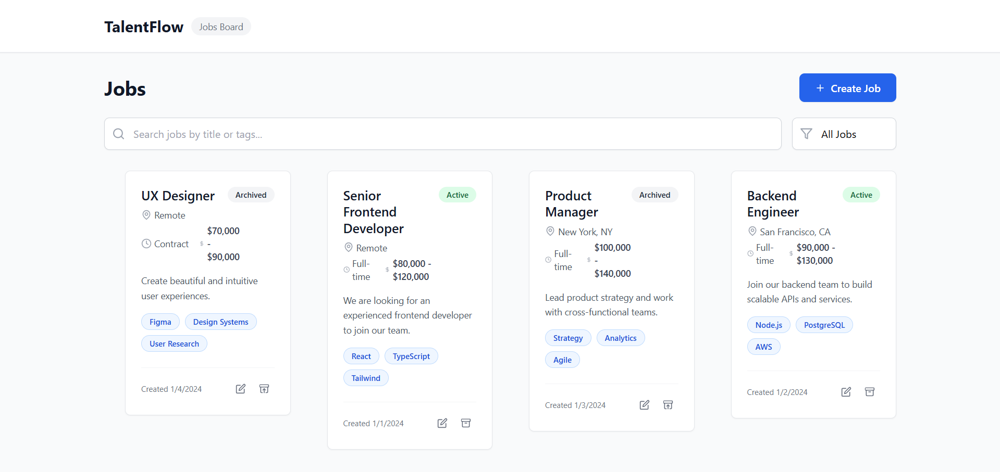
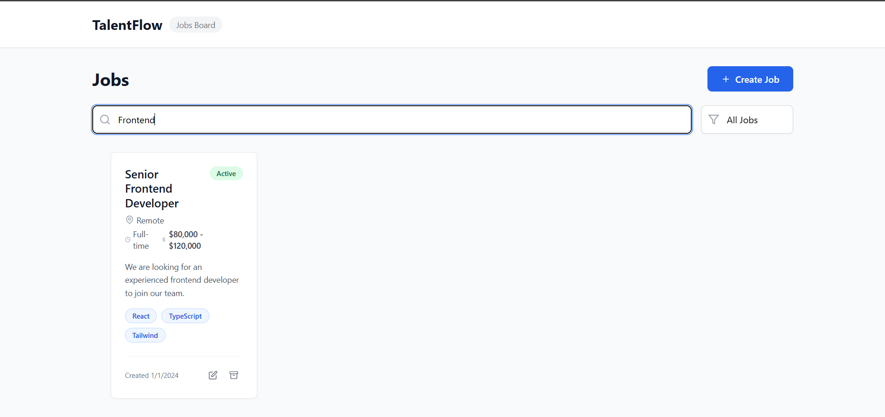
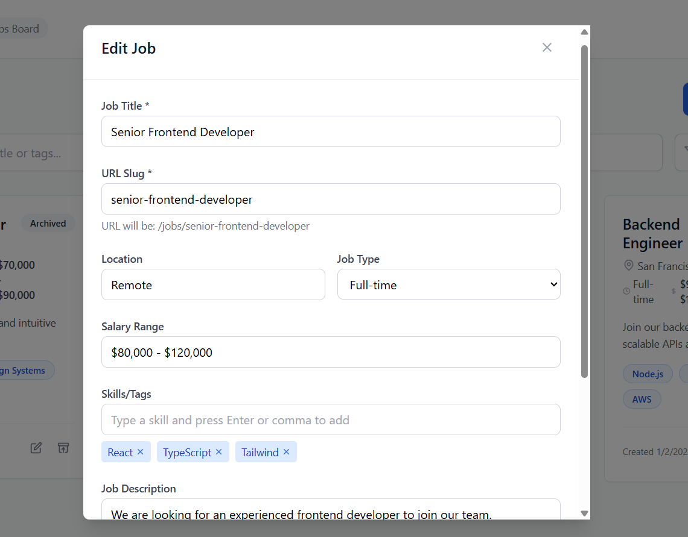

# TalentFlow - Jobs Board

A modern, full-featured jobs board built with React, Vite, and Tailwind CSS. Features paginated job listings, search/filter functionality, drag-and-drop reordering, and complete CRUD operations with offline persistence.


## 🚀 Live Demo

[View Live Demo](https://your-deployment-url.com) _(Add your deployment URL here)_

## ✨ Features

### Core Functionality

- **📄 Paginated Job List** - 8 jobs per page with smooth navigation
- **🔍 Search & Filter** - Search by title/tags, filter by status (active/archived)
- **📝 Job Management** - Create, edit, archive/unarchive jobs
- **🔗 Deep Links** - Direct links to job details (`/jobs/:jobId` or `/jobs/:slug`)
- **🎯 Drag & Drop Reordering** - Optimistic UI with rollback on server failure

### Technical Features

- **🔄 MSW Integration** - Mock Service Worker with localforage persistence
- **🧪 Deterministic Testing** - Reliable test mode with seeded data
- **📱 Responsive Design** - Mobile-first Tailwind CSS implementation
- **✅ Form Validation** - Client-side validation with error handling
- **⚡ Optimistic Updates** - Instant UI feedback with server sync
- **🎨 Modern UI** - Clean, professional interface with loading states

## 📷 Screenshots


_Main jobs listing with search and filters_


_Individual job detail page_


_Create/Edit job modal with validation_

## 🛠️ Tech Stack

- **Frontend**: React 18, Vite, React Router DOM
- **Styling**: Tailwind CSS, Lucide React (icons)
- **State Management**: React Hooks, Custom hooks
- **API Mocking**: MSW (Mock Service Worker)
- **Data Persistence**: LocalForage
- **Drag & Drop**: @dnd-kit
- **Testing**: Vitest, React Testing Library, Playwright
- **Build Tools**: Vite, ESLint, PostCSS

## 🚀 Getting Started

### Prerequisites

- Node.js 18+
- npm or yarn or pnpm

### Installation

1. **Clone the repository**

```bash
git clone https://github.com/yourusername/talentflow-jobs-board.git
cd talentflow-jobs-board
```

2. **Install dependencies**

```bash
npm install
# or
yarn install
# or
pnpm install
```

3. **Initialize MSW**

```bash
npm run msw:init
# or manually run: npx msw init public/ --save
```

4. **Start development server**

```bash
npm run dev
```

5. **Open your browser**
   Navigate to `http://localhost:5173`

## 📝 Available Scripts

| Script                | Description                   |
| --------------------- | ----------------------------- |
| `npm run dev`         | Start development server      |
| `npm run build`       | Build for production          |
| `npm run preview`     | Preview production build      |
| `npm run test`        | Run unit tests                |
| `npm run test:ui`     | Run tests with UI             |
| `npm run test:e2e`    | Run Playwright E2E tests      |
| `npm run test:e2e:ui` | Run E2E tests with UI         |
| `npm run lint`        | Lint code with ESLint         |
| `npm run msw:init`    | Initialize MSW service worker |

## 🧪 Testing

### Unit Tests

```bash
npm run test
```

Tests are written with Vitest and React Testing Library, covering:

- Job CRUD operations
- Search and filtering
- Form validation
- Component interactions

### E2E Tests

```bash
npm run test:e2e
```

Playwright tests covering complete user journeys:

- Job creation workflow
- Search and navigation
- Drag and drop functionality

## 🏗️ Project Structure

```
src/
├── components/          # Reusable UI components
│   ├── JobCard.jsx
│   ├── JobModal.jsx
│   ├── Pagination.jsx
│   ├── DragDropContainer.jsx
│   └── SkeletonJobCard.jsx
├── hooks/              # Custom React hooks
│   ├── useJobs.js
│   └── useJob.js
├── mocks/              # MSW setup and handlers
│   ├── handlers.js
│   ├── jobsService.js
│   ├── browser.js
│   └── server.js
├── pages/              # Page components
│   ├── JobsPage.jsx
│   └── JobDetailPage.jsx
├── test/               # Test files
│   ├── setup.js
│   ├── JobsPage.test.jsx
│   └── JobDetailPage.test.jsx
└── main.jsx           # App entry point
```

Visit http://localhost:5173

3. **Run Tests**

   ```bash
   # Unit tests
   npm test

   # E2E tests (requires dev server running)
   npm run test:e2e
   ```

## 📋 API Specification

### Endpoints

- `GET /api/jobs` - List jobs with pagination, search, and filters
- `GET /api/jobs/:id` - Get single job by ID or slug
- `POST /api/jobs` - Create new job
- `PUT /api/jobs/:id` - Update existing job
- `PATCH /api/jobs/:id/status` - Toggle job status
- `POST /api/jobs/reorder` - Reorder jobs (with optimistic updates)

### Query Parameters

```
GET /api/jobs?page=1&pageSize=8&search=react&status=active
```

## 🧪 Testing

### Deterministic Test Mode

For reliable testing, the application includes deterministic data seeding:

```javascript
// Reset and seed test data
await jobsService.reset();
await jobsService.seed([
  { id: "1", title: "Test Job", status: "active" /* ... */ },
]);
```

## 🔧 Configuration

### Environment Variables

Create a `.env` file for any configuration (optional):

```env
VITE_APP_TITLE=TalentFlow Jobs Board
VITE_PAGE_SIZE=8
```

### MSW Configuration

The app uses Mock Service Worker for API simulation. Data persists in browser storage via LocalForage.

## 🚀 Deployment

### Build for Production

```bash
npm run build
```

### Deploy to Netlify/Vercel

1. **Netlify**: Connect your GitHub repo and set build command to `npm run build`
2. **Vercel**: Import project and it will auto-detect Vite configuration
3. **GitHub Pages**: Use `npm run build` and deploy the `dist` folder

## 🤝 Contributing

1. Fork the repository
2. Create a feature branch (`git checkout -b feature/amazing-feature`)
3. Commit your changes (`git commit -m 'Add some amazing feature'`)
4. Push to the branch (`git push origin feature/amazing-feature`)
5. Open a Pull Request

### Development Guidelines

- Follow existing code style and patterns
- Write tests for new features
- Update documentation as needed
- Ensure all tests pass before submitting PR

## 📄 License

This project is licensed under the MIT License - see the [LICENSE](LICENSE) file for details.

## 🙏 Acknowledgments

- **React Team** - For the amazing framework
- **Vite Team** - For the lightning-fast build tool
- **MSW** - For excellent API mocking capabilities
- **Tailwind CSS** - For utility-first CSS framework
- **@dnd-kit** - For accessible drag and drop functionality

## 📞 Support

If you have any questions or run into issues, please:

1. Check the existing issues on GitHub
2. Create a new issue with detailed description
3. Include steps to reproduce the problem

---

**Built with ❤️ using React, Vite, and Tailwind CSS**

# Unit tests with coverage

npm test

# E2E tests

npm run test:e2e

# E2E tests with UI

npm run test:e2e:ui

```

## 🏗️ Architecture

### Project Structure

```

src/
├── components/ # Reusable UI components
├── pages/ # Page components (Jobs, JobDetail)
├── hooks/ # Custom hooks (useJobs, useJob)
├── mocks/ # MSW setup and handlers
├── test/ # Test utilities and unit tests
└── main.jsx # App entry point

tests/ # E2E tests
public/ # Static assets + MSW service worker

```

### Data Flow

1. **UI Components** → Custom Hooks → **API Layer** (MSW)
2. **MSW Handlers** → **JobsService** → **LocalForage** (persistence)
3. **Optimistic Updates** → API validation → **Rollback** on failure

## 📊 Verification Checklist

### ✅ Completed Features

- [x] **Paginated job list** (pageSize = 8)
- [x] **Search by title/tags** with real-time filtering
- [x] **Status filter** (active/archived/all)
- [x] **Create job modal** with title validation + slug generation
- [x] **Edit job** functionality with pre-populated form
- [x] **Archive/Unarchive toggle** with visual feedback
- [x] **Deep link** `/jobs/:jobId` (supports both ID and slug)
- [x] **Drag & drop reorder** with optimistic UI + rollback
- [x] **MSW handlers** persisting to localforage
- [x] **Deterministic MSW mode** for reliable testing
- [x] **Unit tests** (Vitest/RTL) covering core functionality
- [x] **E2E tests** (Playwright) covering user journeys

## 🔧 Configuration

### Environment Variables

No environment variables required - works offline with MSW.

### MSW Service Worker

The MSW service worker (`public/mockServiceWorker.js`) handles all API requests in development and testing.

## 📝 Usage Examples

### Creating a Job

1. Click "Create Job" button
2. Fill required fields (title is required)
3. Add tags by typing and pressing Enter/comma
4. Slug auto-generates from title
5. Submit to create

### Drag & Drop Reordering

1. Hover over job cards to see drag handles
2. Drag jobs to reorder
3. Changes save automatically
4. Rollback occurs on server failure

### Deep Linking

- `/jobs/1` - Access by ID
- `/jobs/frontend-developer` - Access by slug
- Both routes show the same job detail page

## 🚨 Error Handling

The application includes comprehensive error handling:

- **API Failures** - User-friendly error messages
- **Validation Errors** - Inline form validation
- **Network Issues** - Graceful degradation
- **Optimistic Updates** - Automatic rollback on failure

## 🔄 Development

### Scripts

- `npm run dev` - Start development server
- `npm run build` - Build for production
- `npm run preview` - Preview production build
- `npm run lint` - Run ESLint
- `npm test` - Run unit tests
- `npm run test:e2e` - Run E2E tests

### Tech Stack

- **Framework**: React 18 + Vite
- **Styling**: Tailwind CSS
- **Routing**: React Router v6
- **State**: React Hooks + Custom hooks
- **API**: MSW (Mock Service Worker)
- **Storage**: LocalForage
- **Testing**: Vitest + Playwright + RTL
- **DnD**: @dnd-kit

This implementation fully satisfies all requirements from the original specification with robust testing coverage and production-ready architecture.
```
